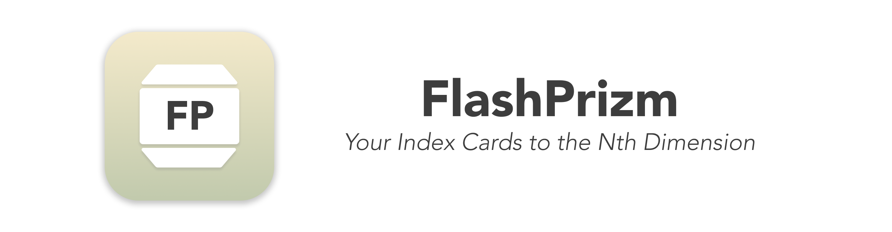
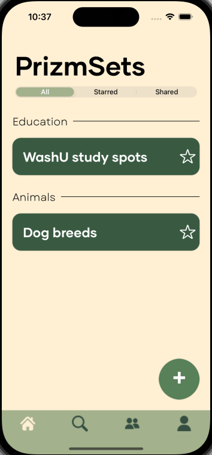
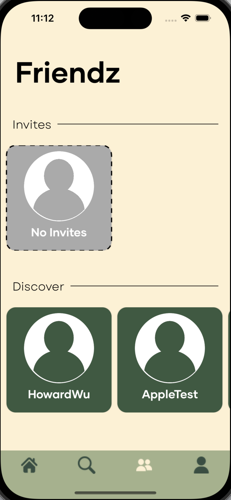

# 🗒️ FlashPrizm iOS App

**Created with Michelle Kwan \(@mllk17\), Cade Edney \(@cedney97\) and Howard Wu \(@HowardWHW\)**

iOS Mutli-Dimensional Index Card app created for Mobile App Dev II Class

_\#Swift \#SwiftUI \#Firebase_ 

> [!IMPORTANT]
> The app does not work now, as the backend servers are down. Please refer to screenshots for what FlashPrizm looks like.

## Premise 
Although existing flash card apps are great, we feel that students tend to put the key term on the blank side, and cram all the definitions and information on the other side, which can be cluttered and messy. FlashPrizm aims to solve the cluttered side of the flash card by creating "Prizms", where instead of having just one side of a card for the definitions, can have unlimited sides of a prizm for more organized learning. 

## Features
1. Clean UI with warm, muted colors to better focus on the Prizms themselves.
2. User Account Creation
3. Create, edit and view "Prizms" with multiple sides
4. View all Prizms in the Home Page with filtering options
5. Share "PrizmSets" (a collection of Prizms) to "Friendz" 
6. Search PrizmSets in your collection

## This Project Showcases: 
- 📚 Full stack web development
  - **Swift/SwiftUI** for the frontend framework
  - **Google Firebase** for the backend framework
- 🏃‍♂️ Agile development with teammates, from prototyping to release

## My Contributions
- I contributed to the creation of the Create and Edit PrizmSet page, View PrizmSet page, Search PrizmSet page, and Share PrizmSet page.

## Screenshots

> Home Screen

> Create/Edit PrizmSet Page

> View PrizmSet Page

> Share PrizmSet Page

> Search PrizmSet Page

> Friendz Page

> Profile Screen

## To Improve for V2 
- [ ] Brand new UI
- [ ] The ability to add pictures and unlimited formatting in Prizms
- [ ] Collaborative PrizmSets between Friendz
- [ ] Different views of PrizmSets (with ARKit?) 

   
